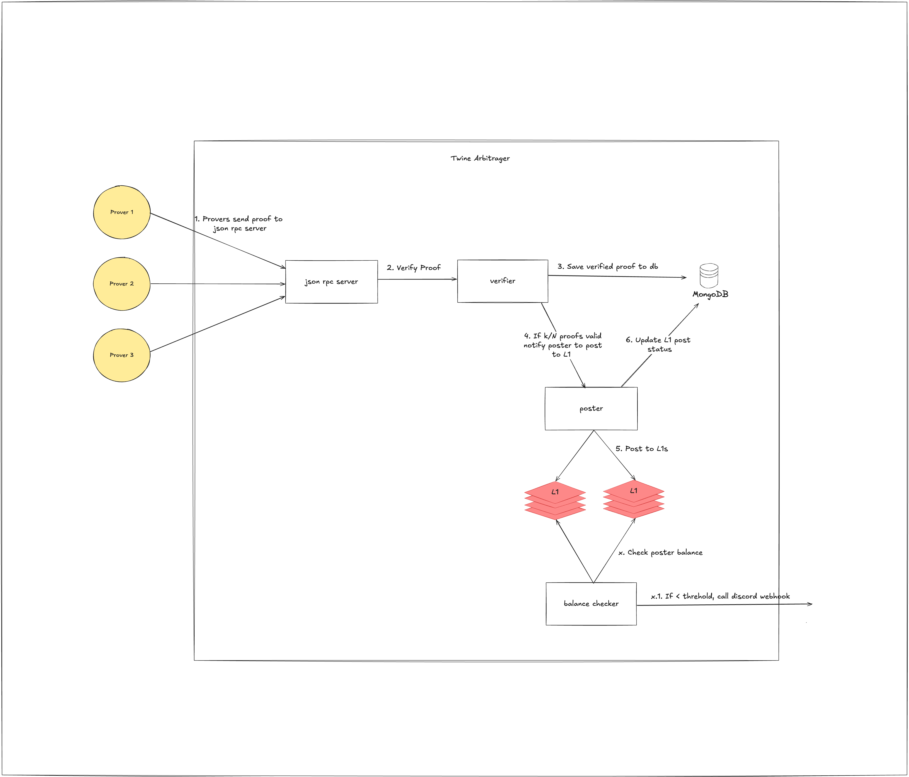

# Twine Arbitrager

Twine arbitrager aggregates proofs from the provers for twine node. When k out of N proofs are verified, then, this service posts the proofs to all the L1s.



## Run Arbitrager
1. Generate config based on config.yaml.
    > Note: You might have to give network access to mongodb atlas if you're using one.


2. Run the arbitrager as
    ```sh
    cargo build --release
    cargo run --release -- --config config.yaml run
    ```

    > Release flag is needed for sp1 verification.

3. Clients should send proof to server with the following json rpc request. 
    ```json
    {
    "jsonrpc": "2.0",
    "method": "twarb_sendProof",
    "params": [
        {
        "type": "SP1Proof",
        "identifier":"identifier1",
        "proof": "proof.json file contents of sp1"
        }
    ]
    }
    ```
    **Example**
    ```sh
    ./post_proof.sh assets/proof.json
    ```