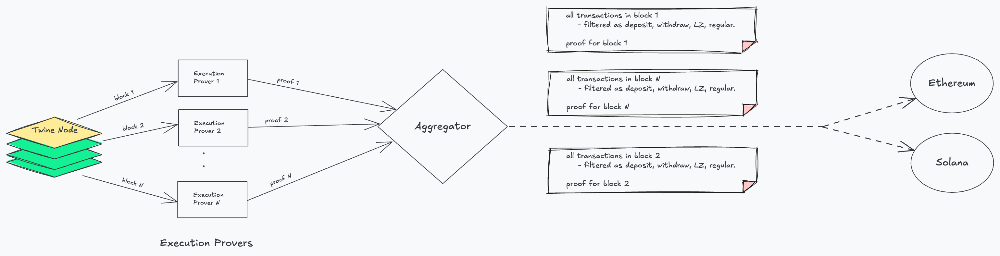

# Twine Aggregator

The **Twine Aggregator** is a critical component of the Twine L2 network, responsible for aggregating, verifying, and committing execution proofs from multiple block execution provers. These operations ensure that all blocks produced by the Twine node are properly verified and submitted to supported Layer 1 (L1) blockchains.

---

## **Overview**
Twine operates with a block time of under **15 seconds**, which demands high throughput and efficient proof generation. Since generating execution proofs for a single block takes approximately **3 minutes**, multiple **execution provers** are used in parallel to keep up with the pace of block production.

The aggregator coordinates the flow of execution proofs, verifies them, and commits the results to L1s.

---



---


## **Workflow**

### **1. Block Proof Generation**
- The scheduler assigns block heights to execution provers.
- Provers work in parallel to generate SP1 proofs for their assigned blocks.
- Provers send SP1 proof of block execution to the aggregator.

### **2. Proof Verification**
- The aggregator verifies the SP1 proof sent by the prover node
- Once the proof is verified, the proof is saved to a DB for backup.
- For added security, we can have multiple provers geenrate proof for a same block. For this, we can have k / N threshold check, where once k proofs are verified, we go to the step below.

### **3. Block Commit**
- Once the proof is verified:
  - The aggregator extracts all transactions from the block and categorizes them.
  - It sends categorized transaction objects to the supported L1s for processing.

### **4. Groth16 Block Proof**
- After the block information is committed, the aggregator sends the corresponding Groth16 proof to the L1s to complete the block submission process.


## **Settlement on L1**
### **1. Commit Batch**
- All the transactions in a block are commited to L1. There are primarily 4 types of transactions, which are explained in detail [here](../docs/transactions.md)
- The transactions are separated based on these 4 types, and are posted in each L1s. 
- The parameter structure for commiting a batch to L1 is:

    ```c
    struct CommitBatchInfo{
        uint64 batchNumber;
        bytes32 batchHash;
        bytes32 previousStateRoot;
        bytes32 stateRoot;
        bytes32 transactionRoot;
        bytes32 receiptRoot;
        TransactionObject[] depositTransactionObject;
        TransactionObject[] forcedTransactionObjects;
        TransactionObject[] layerZeroTransactionObjects;
        TransactionObject[] otherTransactions;
    }
    ```

### **2. Finalize Batch**
- Once the batch is commited, groth16 proof for verifying the correct block execution is submitted to L1. Once this verification is complete on L1, we can confirm the block has been settled on L1. 